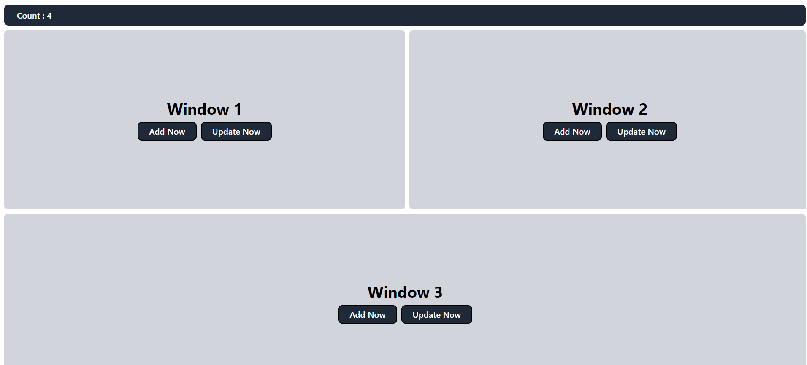

# Data Neuron Assignment



Data Neuron Assignment - Using Vite, React.
[Live Demo](https://data-neuron-delta.vercel.app)

## Tech Stack

**React, Split-Pane-react, JavaScript, Tailwind, Redux, reduxTollkit, Axios, Nodejs, ExpressJs, Mongoose, MongoDB**

## Features

- **All Three Cards are Resizable from there edges**
- **Add: This feature that add new content in a particular Card**
- **Update: This feature that update new content in a particular Card**
- **Count: Count on navbar that gives the no of add and upadate button is used (How many times Add and Upadate Api is called)**

## Getting Started

First you need clone this project.

```bash
git clone https://github.com/se-ashishgupta/DataNeuron-Assignment
```

Now You have to add .env file in client root folder and in server root folder also.
And Now Fill This Given Variable

** Client **

```bash
VITE_SERVER_URL = http://localhost:5000/api/v1
```

** Server **

```bash
PORT=5000
MONGO_URI=
FRONTEND_URL=http://localhost:5173

```

Finally cloned this repository and Added .env files in both client and server, Now Install dependencies and run the local server

** Client **

```bash
cd DataNeuron-Assignment/client
npm install
npm run dev
```

** Server **

```bash
cd DataNeuron-Assignment/server
npm install
nodemon server.js
```
